# AWS-S3-REPLICATION

## Summary

### **AWS S3 Replication Summary**  

1. **Create Two S3 Buckets** 🪣  
   - **Source Bucket**: Where files are initially uploaded.  
   - **Destination Bucket**: Where files will be replicated.  

2. **Enable Versioning on Both Buckets** 🔄  
   - Ensure versioning is enabled on both the source and destination buckets.  

3. **Set Up Replication Rule** 🔧  
   - Go to the **source bucket** → **Management** → **Create replication rule**.  
   - Select the **destination bucket**.  
   - Choose IAM role permissions or create a new one.  

4. **Test Replication** 📂  
   - Upload a file to the **source bucket** and check if it appears in the **destination bucket**.  

This setup ensures automatic data replication for backup or disaster recovery! 🚀

# Step - 1

i. Lets create a S3 Bucket

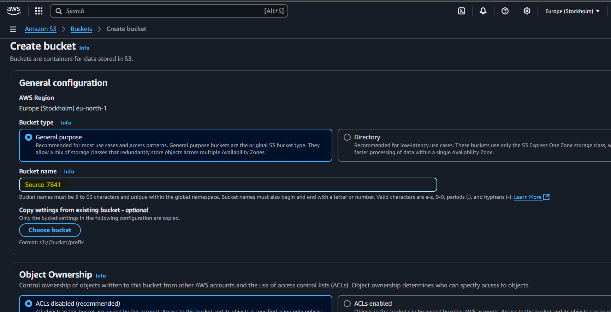

ii. Ensure this configuration for public access

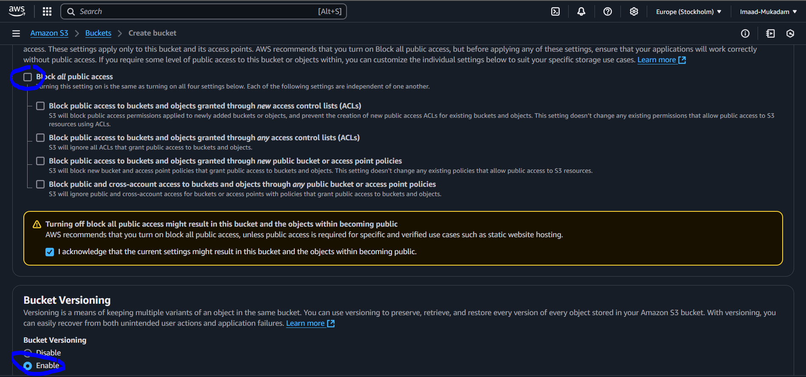

iii. Create another bucket with same configuration (This is for Replication , you can choose another region for more avaibility)

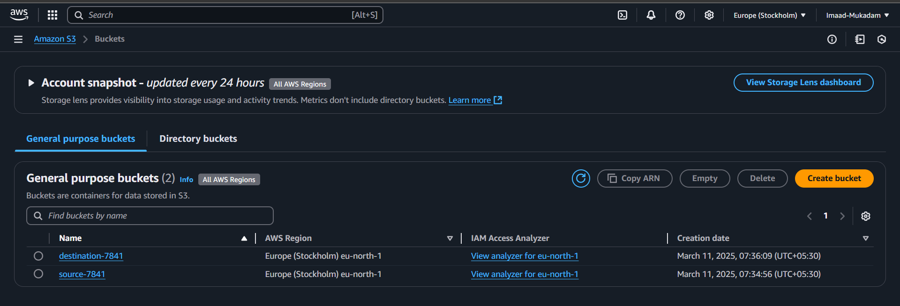

iv. Upload your data

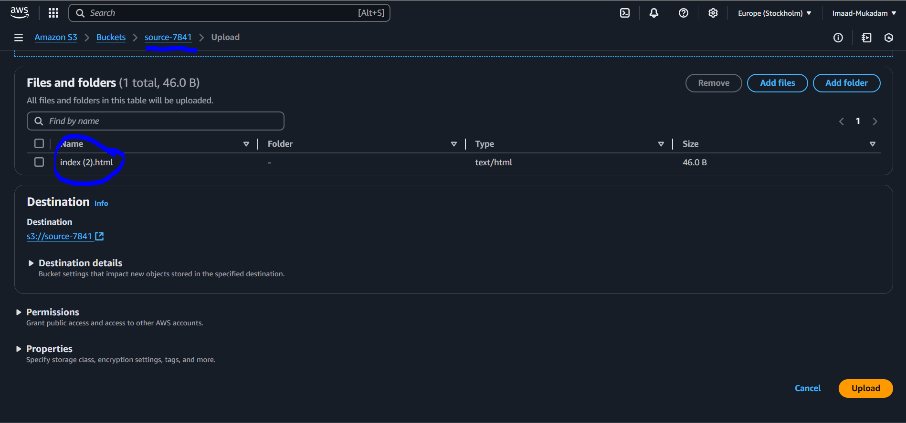

# Step - 2

i. Go in Management section

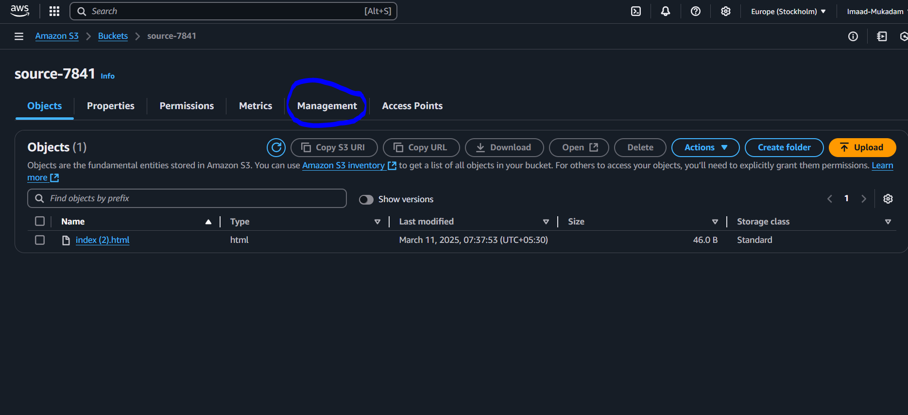

ii. Now, create an application rule to define where your primary bucket should transfer data during disaster recovery.

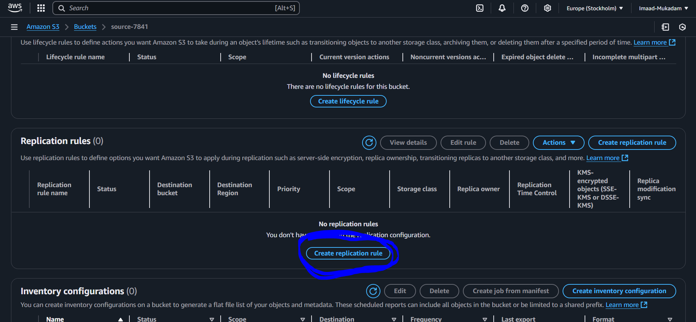

iii. Choose apply to all objects in a bucket to transfer all your data 

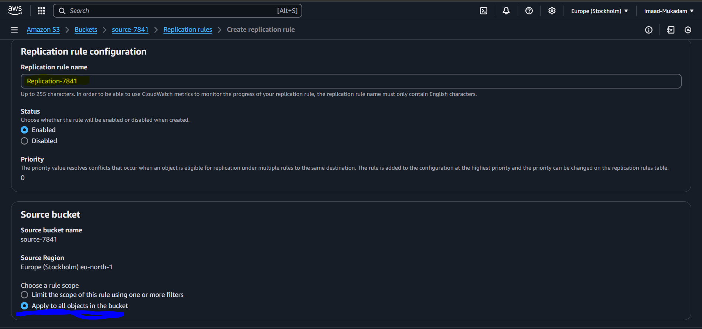

iv. Then browse to select your destination bucket

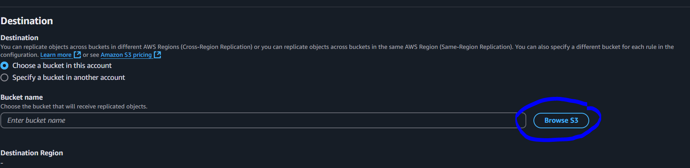

v. Select create a new role , then click on save

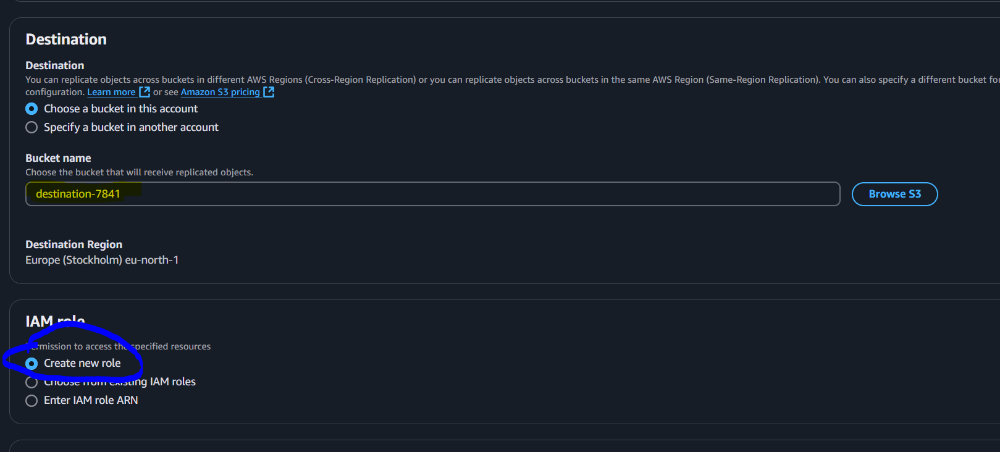

vi. Then you will see this popup , select the option based on your requirements

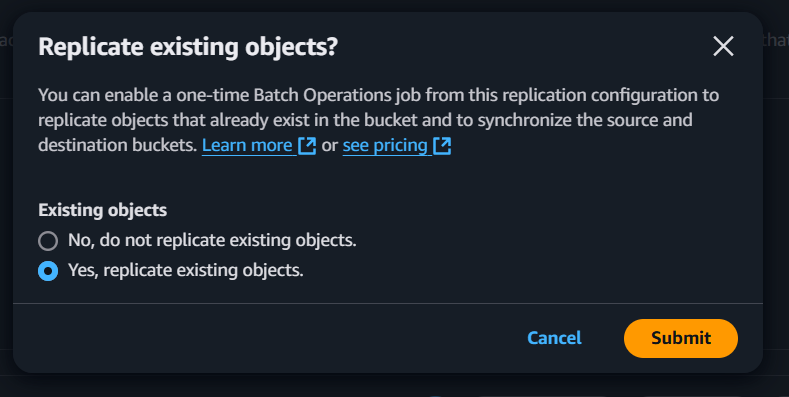

vii. Apply this configuration

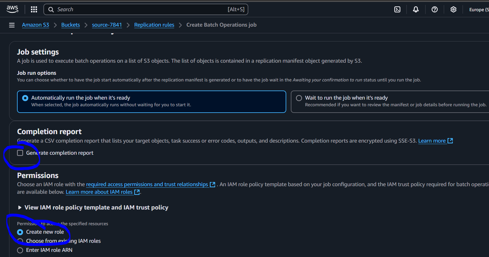

# Step - 3

i. Upload some data in your primary bucket , then refresh in your destination bucket

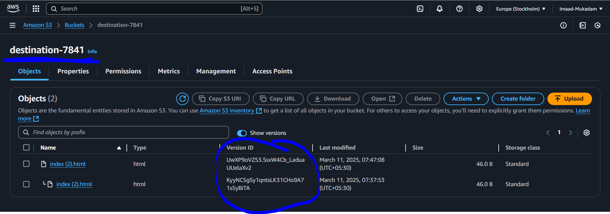

